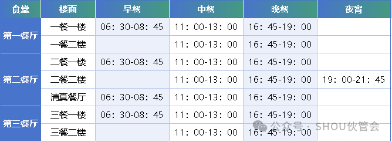

# 校内餐饮与食堂

> [!CAUTION]注意
> 自2024年3月18日起，校园内食堂就餐(一餐、二餐、三餐)将全面启用校园一卡通支付方式，使用校园一卡通以外方式支付结算时收取20%搭伙费。

海大校内分布有多个风格各异的学生食堂与风味餐厅，提供丰富的早中晚餐选择。

## 主要食堂概况

该部分在我校“伙管会”公众号上做了详细介绍，现附上[文章链接](https://mp.weixin.qq.com/s/rXPpxQu7EN20KlepQj-Tbw)

## 支付方式与营业时间

- **支付方式**：支持 **校园一卡通实体卡**、**校园一卡通二维码**（微信小程序）及直接使用微信/支付宝扫码支付。
- **常规供餐时段**：

## 避坑与就餐贴士

1. **错峰就餐**：由于上午课程结束时间集中在 11:40，中午是食堂就餐高峰时段。建议上午最后一节无课或提早下课的同学提前就餐，避免排队。
2. **光盘行动**：食堂设有自主餐盘回收传送带或分类回收处，请文明就餐，自觉回收餐盘餐具。

