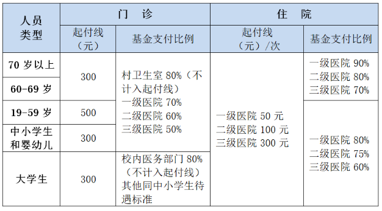

# 医疗与医保

身体健康是大学生活的第一保障。在校期间生病就医、医保卡使用及报销流程如下。

## 大学生居民医保与报销

- **参保资格**：按学年统一缴纳上海市城乡居民基本医疗保险（大学生）。
  - 首年 9 月至 12 月底无需参保即可享受医保待遇。
- **门诊报销**：上海市门诊当年达到 300 元起付线后按规定比例直接减免。
  - 上海市大学生医保与中小学生医保同一待遇。

- **住院与大病保障**：在上海市内定点公立医保医院住院治疗时，出示上海医保电子凭证或社保卡可直接进行医保实时联网结算。

## 校医院（门诊部）就医

- **门诊位置**：东体育场西看台一楼。
- **服务范围**：内科、外科常见病诊疗，常规化验（血常规等），外伤包扎清创，输液以及常见处方药配发。
- **就诊时间**：
  - 日常门诊：周一至周四 `08:00 - 19:00`，周五`08:15 - 15:15`，双休日与节假日`08:15 - 16:15`。
  - 无急诊。
- **就诊证件**：就诊时请携带 **校园一卡通 / 电子校园卡** 与 **医保卡 / 医保电子凭证**。
- **联系方式**：021-61900120

## 校外定点医院与转诊

临港及周边主要公立综合性三甲/二甲医院：
1. **上海市第六人民医院（临港院区）**（三级甲等综合医院）：
   - 地址：浦东新区环湖西三路222号。
   - 临港医疗资源最强的综合医院，各类专科齐全，急危重症或需复杂检查时首选。
2. **就医转诊提示**：
   - 根据上海市大学生基本医疗保障政策，大学生医保报销已不再需要转诊，请直接前往六院挂号。

