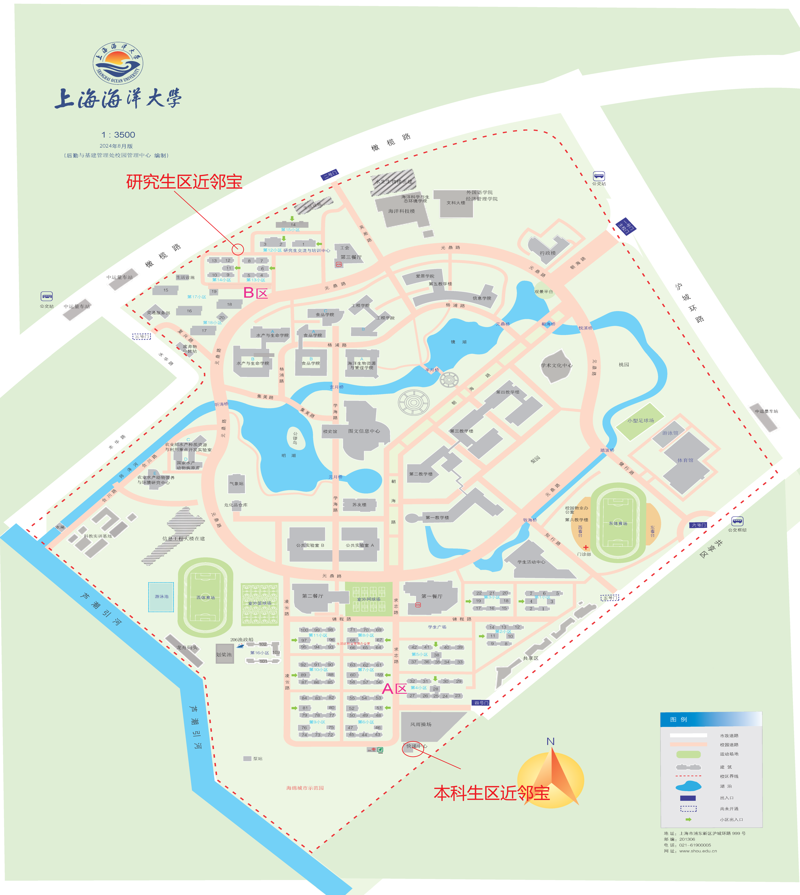

# 快递与收发

学校在校内及设立了两处集中的快递服务站与智能快递柜。


## 快递收发点分布

> [!tip]注意
> 快递存放不收取费用；4天以上未取的快递将作退回处理

> [!tip]注意
> 本科生区近邻宝在高峰时可能会使用风雨操场堆放快递

1. **本科生区近邻宝**
   - 靠近宿舍A区。
   - 顺丰，京东快递凭短信或京东/顺丰小程序取件码在进门左侧柜台取件。
   - 其余品牌快递会投递到外面的智能快递柜或近邻宝内的快递架。
     - 智能快递柜可24小时取件，可以在快递柜输入取件码或者在近邻宝小程序输入取件码取件。本区快递柜编号为 1-17 。
     - 近邻宝内快递架可在`07:00 - 19:00`取件，取件需要同时扫拼多多取件码与快递条形码取件。只能使用拼多多查看取件码。
2. **研究生区近邻宝**
   - 靠近宿舍B区。
   - 顺丰，京东快递不在此处投递。
   - 其余品牌快递会投递到外面的智能快递柜或近邻宝内的快递架。
     - 智能快递柜可24小时取件，可以在快递柜输入取件码或者在近邻宝小程序输入取件码取件。本区快递柜编号为 18 - 22 。
     - 近邻宝内快递架可在`07:00 - 19:00`取件，取件需要同时扫拼多多取件码与快递条形码取件。只能使用拼多多查看取件码。
3. **物流**
   - 学校没有设置物流配送点，请协商前往校门口接收。



## 快递收件地址填写模板

为了确保快递准确投递到所在地址，建议按照以下格式填写：

```
收件人：姓名
联系电话：1XXXXXXXXXX
收货地址：上海市浦东新区南汇新城镇沪城环路999号上海海洋大学本科生区近邻宝 或 上海市浦东新区南汇新城镇沪城环路999号上海海洋大学研究生区近邻宝
```


## 寄件服务与大件行李

- **日常寄件**：可通过菜鸟裹裹、顺丰小程序直接下单，选择“服务点自寄”并前往近邻宝称重打单。
- **毕业季/寒暑假大件行李托运**：京东通常会在食堂广场或宿舍区设立专门的现场行李托运点，提供编织袋打包装箱与上门搬运优惠服务。
- 在 4 号门外有优惠寄件。

## 信件 ##

- 我校邮局在本科生近邻宝旁边，设有邮局与邮筒。平信，报纸收发室在一餐一楼ATM机与打印机之间。
- 挂号信通常会电话联系在一餐门口等待。

邮政地址

```
上海市浦东新区南汇新城镇沪城环路999号上海海洋大学邮局
邮政编码：201306
```